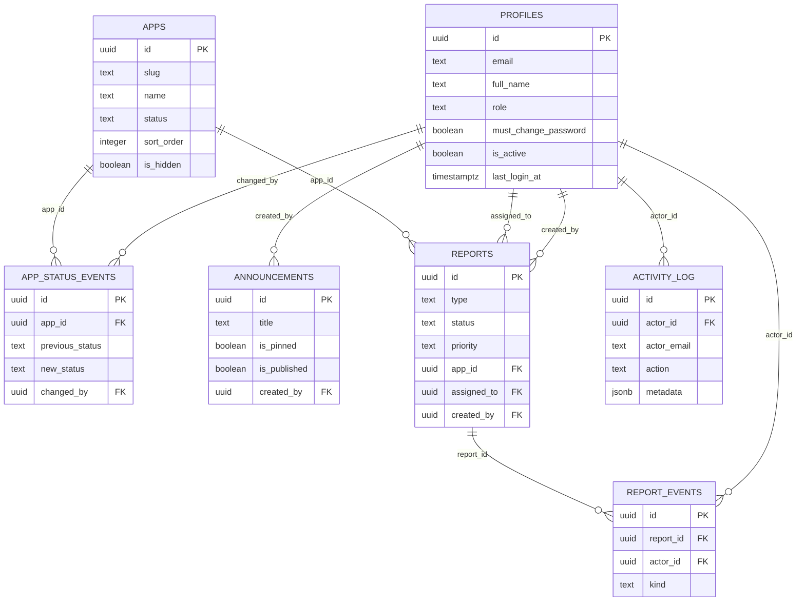

# Modèle de données

Ce document décrit le schéma SQL défini dans `supabase/migrations/` : les
tables, les relations, la matrice RLS (qui peut lire/écrire quoi) et les
fonctions SQL exposées. Pour l'organisation du code qui consomme ce schéma
(repositories, fabrique), voir `docs/ARCHITECTURE.md`.

## Schéma entités-relations

`auth.users` (géré par Supabase Auth, hors de ce schéma) est la table
racine : `profiles.id` y fait référence avec `ON DELETE CASCADE`.

## Tables

### `profiles`

Profil applicatif associé à un utilisateur Supabase Auth. Créé automatiquement
par le trigger `handle_new_user` (toujours avec `role = 'user'` — jamais lu
depuis les métadonnées fournies par l'utilisateur à l'inscription).

| Colonne                | Type          | Description                                                 |
| ---------------------- | ------------- | ----------------------------------------------------------- |
| `id`                   | `uuid`        | = `auth.users.id`                                           |
| `email`                | `text`        | Unique, toujours en minuscules                              |
| `full_name`            | `text`        | Facultatif                                                  |
| `role`                 | `text`        | `user` ou `admin`                                           |
| `must_change_password` | `boolean`     | Vrai tant que le mot de passe provisoire n'a pas été changé |
| `is_active`            | `boolean`     | Un compte désactivé ne peut plus se connecter               |
| `last_login_at`        | `timestamptz` | Mis à jour par le service d'auth (étape 3)                  |

### `apps`

Catalogue des applications internes. `status` est modifié exclusivement via
la fonction `set_app_status` (jamais par un `UPDATE` direct en usage normal),
qui journalise aussi l'événement dans `app_status_events`.

| Colonne      | Type      | Description                                      |
| ------------ | --------- | ------------------------------------------------ |
| `slug`       | `text`    | Unique, kebab-case, 2 à 60 caractères            |
| `status`     | `text`    | `online`, `offline` ou `maintenance`             |
| `sort_order` | `integer` | Ordre d'affichage, réattribué via `reorder_apps` |
| `is_hidden`  | `boolean` | Masque l'app pour les utilisateurs non admin     |
| `icon`       | `text`    | Nom d'icône lucide-react en kebab-case           |

### `app_status_events`

Historique des changements de statut (append-only). Une ligne par changement
réel de statut (aucune ligne si seul le message a changé).

### `announcements`

Annonces internes épinglables (implémentation du repository à l'étape 7).

### `reports` / `report_events`

Signalements de bugs et demandes, avec un journal de suivi
(`report_events`) qui prépare le futur outil SAV (implémentation du
repository à l'étape 8).

### `activity_log`

Journal d'activité applicatif, append-only, écrit uniquement par le service
role (aucune policy d'écriture pour les utilisateurs, même admins).

## Matrice RLS

| Table               | SELECT                                            | INSERT                           | UPDATE                      | DELETE |
| ------------------- | ------------------------------------------------- | -------------------------------- | --------------------------- | ------ |
| `profiles`          | soi-même, ou admin                                | — (trigger uniquement)           | — (service role uniquement) | —      |
| `apps`              | utilisateur actif : non masquées ; admin : toutes | admin                            | admin                       | admin  |
| `app_status_events` | admin                                             | admin                            | —                           | —      |
| `announcements`     | utilisateur actif : publiées ; admin : toutes     | admin                            | admin                       | admin  |
| `reports`           | créateur, ou admin                                | utilisateur actif, pour soi-même | admin                       | admin  |
| `report_events`     | admin                                             | admin                            | admin                       | admin  |
| `activity_log`      | admin                                             | — (service role uniquement)      | —                           | —      |

« — » signifie : aucune policy pour `authenticated` ; l'opération n'est
possible qu'avec le service role (qui contourne la RLS), depuis du code
serveur ayant déjà vérifié les droits nécessaires.

## Fonctions SQL

| Fonction                     | Rôle autorisé  | Description                                                                                   |
| ---------------------------- | -------------- | --------------------------------------------------------------------------------------------- |
| `public.set_updated_at()`    | (trigger)      | Maintient `updated_at` à jour sur `UPDATE`.                                                   |
| `public.handle_new_user()`   | (trigger)      | Crée le profil (`role = 'user'`) à l'inscription Auth.                                        |
| `public.is_active_user()`    | tout rôle      | Vrai si l'utilisateur courant a un profil actif. Utilisée dans les policies RLS.              |
| `public.is_admin()`          | tout rôle      | Vrai si l'utilisateur courant est admin actif. Utilisée dans les policies RLS.                |
| `public.set_app_status(...)` | `service_role` | Change le statut d'une app et journalise l'événement si le statut change. **À porter en V2.** |
| `public.reorder_apps(...)`   | `service_role` | Réattribue `sort_order` selon l'ordre fourni, atomique. **À porter en V2.**                   |

## Notes de migration V2 (SQL Server)

La V2 (serveur interne Carrefour Property) remplace Supabase par SQL Server
et le SSO d'entreprise. Correspondances à prévoir :

- **Types** : `uuid` → `uniqueidentifier` ; `timestamptz` → `datetimeoffset` ;
  `text` → `nvarchar(max)` ou `nvarchar(n)` selon la contrainte de longueur ;
  `jsonb` (`activity_log.metadata`) → colonne `nvarchar(max)` validée en JSON
  (fonctions `ISJSON`/`JSON_VALUE` de SQL Server), ou une table dédiée si des
  requêtes structurées sur ce contenu s'avèrent nécessaires.
- **Fonctions à porter** : `set_app_status` et `reorder_apps` deviennent des
  procédures stockées SQL Server (`CREATE PROCEDURE`), appelées depuis
  `src/lib/data/providers/sqlserver/` (nouveau dossier, même interface
  `AppRepository`). `handle_new_user` devient soit un trigger `AFTER INSERT`
  sur la table des comptes SSO provisionnés, soit une étape explicite du flux
  de provisioning SSO (à décider selon la façon dont le SSO Carrefour
  Property alimente les comptes).
- **RLS → contrôles applicatifs** : SQL Server ne propose pas d'équivalent
  direct à la Row Level Security Postgres utilisée ici (Row-Level Security de
  SQL Server existe mais fonctionne différemment, via des fonctions de
  sécurité en ligne). Le plus simple est de déplacer les règles d'autorisation
  actuellement portées par les policies RLS vers la couche applicative
  (`src/lib/data/providers/sqlserver/`), en s'appuyant sur le rôle de
  l'utilisateur courant (lu depuis la session SSO) avant chaque requête —
  exactement ce que `is_admin()` / `is_active_user()` expriment aujourd'hui.
- **`handle_new_user`** : en V1, la création du profil est automatique
  (trigger sur `auth.users`). En V2, selon le mécanisme de provisioning SSO
  retenu, il faudra soit un trigger équivalent sur la table des comptes,
  soit un job de synchronisation explicite — dans tous les cas, le rôle
  initial doit rester `user` par défaut, jamais déduit d'une source externe
  non maîtrisée.
- Le reste de l'application (types de domaine, schémas zod, interfaces de
  repository) ne change pas : seul `src/lib/data/providers/` gagne une
  nouvelle implémentation, sélectionnée par `src/lib/data/index.ts`.
